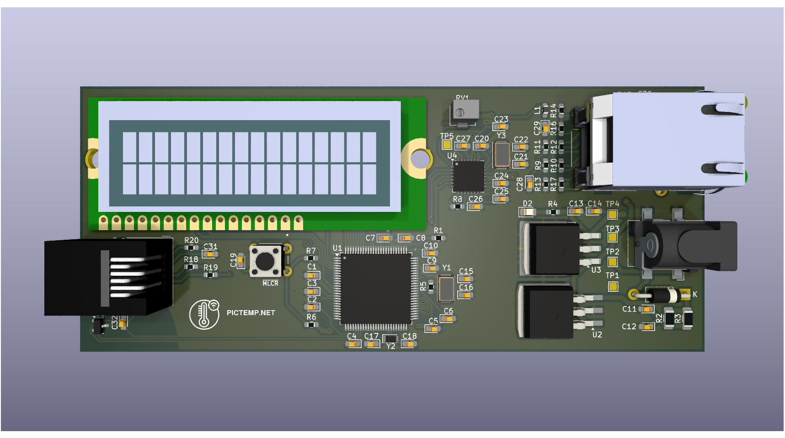
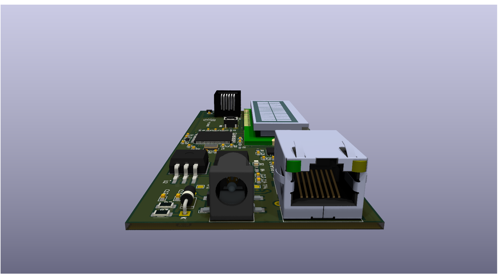
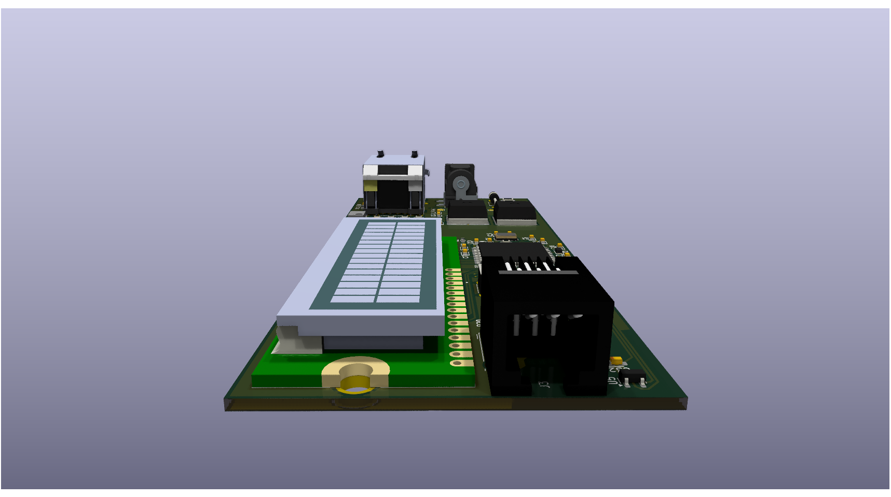

  

## Overview

The **`PICTEMP.NET`** is a standalone IoT temperature sensor based on the *PIC18F97J60*, featuring TCP access over Ethernet using the *ENC28J60* ethernet controller. Includes custom firmware built on the Microchip TCP/IP stack and a compact KiCad-designed PC (similar to *PICDEM2.NET*) ideal for IoT, home automation, and industrial monitoring.

The project demonstrates a full-stack IoT solution:

- **Hardware**: A compact, efficient PCB designed in *KiCad*
- **Firmware**: Integrating sensor acquisition and network communication based on *Microchip Solutions v2011-06-02 TCP/IP Demo App*

The project was tested on the *PICDEM2.NET* development board, which ensured the firmware functionality before transitioning to the custom PCB.

## Hardware

### Core Components

- **Microcontroller:** PIC18F97J60  
- **Ethernet Controller:** ENC28J60 (external)  
- **Temperature Sensor:** TC1047x47  
- **Clock Sources:** 25 MHz, 32 kHz crystals  
- **Power Regulation:** LM2940S-5.0, TC1262-3.3  
- **LCD Display:** LCM-S01602DTR_M  
- **Connectivity:** RJ-12, RJ-45, barrel jack, pushbutton, testpoints

*The full list is available in [*pictempnet.csv*](hardware/pictempnet.csv).*

### Design priorities

- Compact footprint for embedded deployment  
- Efficient routing for signals and power  
- Smaller size to reduce cost and complexity    

### PCB Layout

|  |  |  |
|-|-|-|
| *Top view* | *Right view* | *Left view* |

*More images are available in the [images/](hardware/images) folder.*

## Firmware Architecture

The firmware is based on *Microchip Solutions v2011-06-02 TCP/IP Demo App*, modified to implement temperature sensing functionality. Key components include:  

- *`temperature_sensor.h` / `temperature_sensor.c`* – Interfaces directly with the temperature sensor IC, reading real-time measurements and providing functions to access the data.    
- *`GenericTCPIPServer.c`* – Derived from Microchip sources, enhanced for temperature sensor integration and real-time TCP access.

The firmware manages:  

- TCP connection handling and client requests  
- Temperature sensor sampling on TCP request
- Data buffering and formatting
- Efficient, low-latency response for real-time monitoring  

## Usage

### Project Configuration

The firmware is developed using *Microchip MPLAB X IDE*. It is strongly recommended to compile the project with this IDE due to complex configuration requirements.

In the project properties, set the following options:

- **Categories:** `C18-PICDN2_ENC28`  
- **Device:** `PIC18F97J60`  
- **Compiler Toolchain:** *[`C18 v3.47`](https://mplab-c18.software.informer.com/download/)*  

### Steps to Use

1. **Flash** the firmware to the custom *PCB* or the *PICDEM2.NET* development board.  
2. **Connect** the device to your network via Ethernet. The LCD will display the assigned IP address.  
3. **Access** temperature readings by sending the character `'t'` or `'T'` to *TCP port 2000*.

## Licensing

- **Hardware design**: Licensed under the [CERN-OHL-W-2.0](./hardware/LICENSE).  
- **Firmware**: Licensed under the terms of the [MICROCHIP SOFTWARE LICENSE AGREEMENT](./firmware/LICENSE).  

By **`DOWNLOADING`** or **`USING`** any part of this repository (including but not limited to source code, hardware design files, schematics, documentation, and images) through methods such as:
  - cloning the repository (`git clone ...`)  
  - downloading release archives (`.zip` / `.tar.gz`)  
  - forking the repository  
  - downloading individual files via the GitHub web interface  
  - retrieving the repository via GitHub API or GitHub CLI  
  - mirroring the repository

you **`AGREE`** to the applicable license terms, including the [MICROCHIP SOFTWARE LICENSE AGREEMENT](./firmware/LICENSE).  

